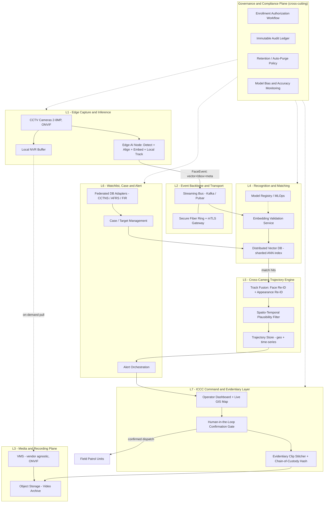
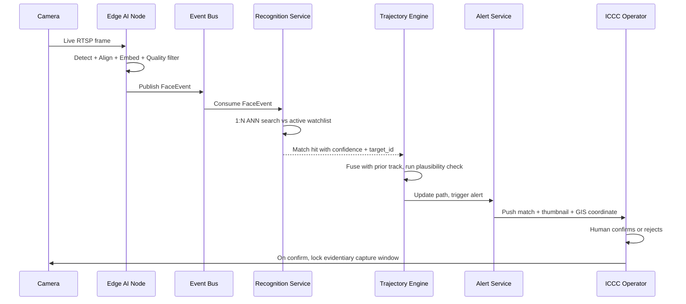
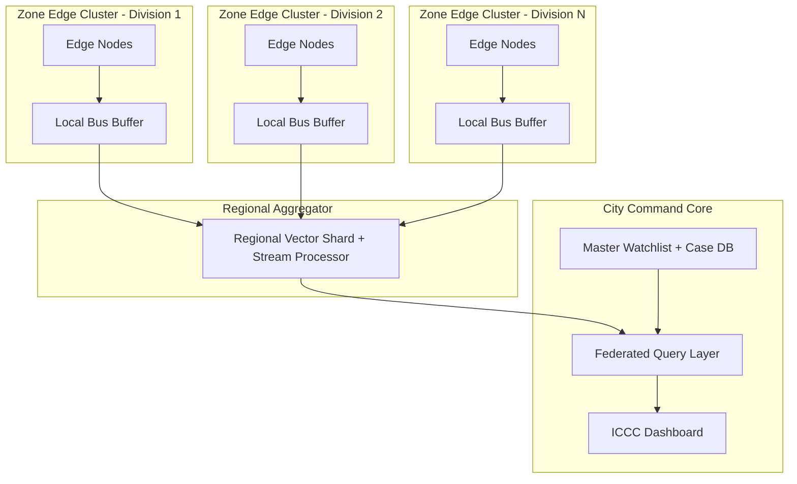

# City-Scale CCTV Face Recognition & Tracking — Architecture Review & Recommended Design

---

## 1. Review of Submitted Architectures

**Relationship between your 3 files:** Doc 1 (`7_layer_architecture.md`) and Doc 2 (`CCTV_Face_Recognition_System_Design_Documentation.md`) are the same content — Doc 2 is a degraded re-export (broken sentences where diagrams/images didn't convert to text). Doc 3 (mermaid) is a parallel diagram of the same 7-layer idea. Treat them as one source.

### 1.1 What's Correct
- Edge-cloud split (push detection/embedding to edge, not raw video) — correct, mandatory at this scale.
- Detect → Align → Embed → Search → Track pipeline — correct standard FR pipeline.
- ANN-based 1:N search (FAISS/HNSW) instead of linear comparison — correct.
- Human-in-the-loop confirmation before field action — correct, and legally important.
- Audit trail requirement — correct.
- Appearance/gait Re-ID as fallback for occlusion — reasonable for cross-camera continuity.

### 1.2 Critical Gaps & Risks
| Issue | Why it matters at 3000–5000+ camera scale |
|---|---|
| **No message bus / event backbone** | Layers are wired as direct point-to-point pipes (Edge→Align, VMS→AI). At scale this creates tight coupling and cascading failure — one slow consumer stalls producers. |
| **Single "core" implied for DB/search/tracking** | No sharding, no zoning, no HA story. A city-wide single core is a single point of failure and a scaling ceiling. |
| **VMS-coupled AI feed** | Doc 3 routes "Obscured Feeds" through VMS into Re-ID. Making live AI inference depend on a commercial VMS's internals creates vendor lock-in and breaks "plug and play." |
| **No model lifecycle / MLOps** | No model versioning, rollout, or accuracy/bias drift monitoring. Face models degrade and need controlled updates — not addressed at all. |
| **No vector DB scaling plan** | A single FAISS/HNSW instance is not HA and doesn't horizontally scale reads/writes. Needs a clustered, sharded, replicated vector store. |
| **Numeric claims stated as fixed constants** | "24px inter-ocular minimum" and "3–5s SLA" are presented as industry constants. In reality both are tunable targets dependent on the specific model/hardware/network in use — validate via pilot, don't hard-code. |
| **Doc 3 internal inconsistency** | `TRACK --> SEARCH` implies tracking happens before matching, but the text says tracking deduplicates *after* a match. Pick one causal order. |
| **No observability layer** | No metrics/tracing/health-checks for the *system itself* (camera offline, model latency creep, queue backlog). You will be blind to degradation until it causes a missed target. |
| **Security stops at MFA + air-gap** | No mTLS between internal services, no secrets management, no encryption-at-rest spec for biometric data. |
| **Evidentiary integrity stops at "stitching"** | No cryptographic hashing/chain-of-custody for clips — needed for the footage to hold up as legal evidence. |
| **No retention/purge policy** | Without auto-deleting non-matched face data, storage and legal liability both grow unbounded. |

### 1.3 Verdict
**Use the 7-layer mental model as a conceptual map — do not implement it as-is.** It's a reasonable starting sketch but is missing the engineering structures (event backbone, sharded vector search, schema contracts, MLOps, governance plane) required for real 3000–5000+ camera scale, high availability, and the modularity/plug-and-play goal you stated. Section 3 below replaces it with an implementation-grade design.

---

## 2. Design Principles for the Recommended Architecture

1. **Decouple everything via an event bus.** No layer calls another layer directly. All communication flows through a streaming backbone (pub/sub). This is what makes the system modular and fault-tolerant.
2. **Edge does the heavy lifting.** Only structured events (embedding + bbox + metadata) leave the edge — never raw video, unless explicitly pulled on-demand for evidence.
3. **Hierarchical federation, not one core.** City → Regional clusters → Zone clusters. Each zone can run semi-autonomously if the city core is unreachable.
4. **Schema contracts at every boundary.** Every inter-service message has a versioned schema (e.g., Protobuf/Avro). This is the actual mechanism that enables plug-and-play.
5. **Stateless, horizontally scalable services.** Anything that processes events should scale by adding replicas, not by growing a monolith.
6. **Polyglot storage** — the right database for each data shape (vectors, time-series/geo, relational case data, object storage for video).
7. **Built-in observability and governance from day one** — not bolted on later.

---

## 3. Recommended System Architecture

**Key structural change from the submitted docs:** L2 is now an explicit message bus, not a passive network. Every layer publishes/subscribes — nothing calls another layer's API directly. This single change is what unlocks horizontal scale and plug-and-play.

---

## 4. Real-Time Event Flow (per detection)

**Latency budget for the 3–5s alert SLA** (validate against actual hardware in pilot, not assumed):

| Stage | Typical budget |
|---|---|
| Edge detect + align + embed | 100–300 ms |
| Publish to bus + network hop | 50–150 ms |
| Vector search (sharded index) | 10–50 ms |
| Track fusion + plausibility check | 100–300 ms |
| Alert push + dashboard render | 200–600 ms |
| **Total** | **~0.5–1.4 s**, leaving margin inside the 3–5 s target |

Vector search itself is *not* the bottleneck here — the watchlist (active targets) is typically only hundreds to low thousands of entries, so ANN lookup is cheap regardless of city size. The real scaling pressure is **event throughput**: thousands of cameras generating detection events concurrently. That's solved by horizontally scaling the consumer side (Recognition Service replicas), not by the index size.

---

## 5. Deployment Topology — Scale Strategy

**Why this scales from 3000–5000 cameras to 10,000+ without redesign:**
- Adding cameras = adding edge nodes to an existing zone, or adding a new zone cluster. No change to L4–L7.
- Adding zones = adding bus partitions + a regional shard. Linear, not architectural change.
- If the city core link drops, a zone keeps detecting/tracking locally and syncs once reconnected — no full outage.
- Vector DB shards (per zone/region) are added independently; the federated query layer fans out and merges results.

---

## 6. Tech Stack

| Layer | Function | Recommended |
|---|---|---|
| L1 Edge | Edge compute | NVIDIA Jetson Orin NX/AGX (current gen) or Hailo-8 ASIC for lower-cost nodes |
| L1 Edge | Edge inference pipeline | NVIDIA DeepStream SDK + TensorRT |
| L1 Edge | Detection | RetinaFace or SCRFD (faster than MTCNN) |
| L1 Edge | Embedding | ArcFace (InsightFace) |
| L1 Edge | Local tracking | ByteTrack |
| L2 Backbone | Event streaming | Apache Kafka (or Pulsar for geo-replicated multi-zone) |
| L2 Backbone | Service security | Istio/Linkerd service mesh with mTLS; WireGuard for 5G failover links |
| L3 Media | VMS | Genetec Security Center / Milestone XProtect (ONVIF Profile S/T, kept vendor-agnostic) |
| L3 Media | Video object storage | MinIO (S3-compatible, on-prem) with hot/warm/cold tiering |
| L4 Recognition | Vector DB | Milvus or Qdrant — sharded, replicated, GPU-accelerated ANN |
| L4 Recognition | Stream processing | Apache Flink |
| L4 Recognition | Model serving | NVIDIA Triton Inference Server (ONNX/TensorRT) |
| L4 Recognition | MLOps | MLflow or Kubeflow — model registry, versioning, drift monitoring |
| L5 Trajectory | Appearance Re-ID | OSNet / FastReID |
| L5 Trajectory | Trajectory store | TimescaleDB + PostGIS (time-series + geospatial); Neo4j optional for path-relationship queries |
| L6 Watchlist | Case/target DB | PostgreSQL |
| L6 Watchlist | Integration adapters | Kong or Apache APISIX API gateway — one isolated adapter per external system (CCTNS/AFRS/FIR) |
| L6 Watchlist | Field notification | MQTT broker or FCM, encrypted channel |
| L7 ICCC | Dashboard | React + Mapbox/Cesium (GIS) + WebRTC video wall |
| L7 ICCC | Evidentiary integrity | Append-only WORM object storage + periodic Merkle-root anchoring (or Hyperledger Fabric if full ledger needed) |
| Cross-cutting | Orchestration | Kubernetes (K3s at edge/zone, full K8s at regional/core) |
| Cross-cutting | Observability | Prometheus + Grafana, OpenTelemetry/Jaeger, Loki/ELK |
| Cross-cutting | Secrets/IAM | HashiCorp Vault, Keycloak (RBAC/ABAC) |
| Cross-cutting | Deployment | GitOps — ArgoCD + Helm |

---

## 7. Plug-and-Play Mechanism

Modularity comes from the **schema contract at each boundary**, not from any single tool choice.

| Component | Swap mechanism | Quality caveat |
|---|---|---|
| VMS vendor | ONVIF/RTSP abstraction; AI pipeline never depends on VMS internals | None — true hot-swap |
| Detection model | Containerized inference behind a versioned API | Re-validate quality thresholds after swap |
| Embedding model | Model registry + versioned FaceEvent schema | **Not a hot-swap.** Different models produce incompatible vector spaces — requires full watchlist re-embedding and a staged cutover (dual-run old/new index briefly) |
| Vector DB engine | Standard gRPC/REST query adapter | Index rebuild + brief dual-run during migration |
| Re-ID model | Same pattern as embedding model | Same re-embedding caveat, for the appearance gallery |
| External DB integration (CCTNS/AFRS/FIR) | Isolated adapter microservice per system | None — additive, isolated failure domain |
| Camera hardware/vendor | ONVIF Profile S/T compliance | Must meet inter-ocular pixel density at install; no software impact |

---

## 8. Scalability Summary

- **Throughput, not index size, is the real scaling axis.** Watchlist size stays small; concurrent camera count drives load — scale by adding Recognition Service replicas and Kafka partitions.
- **Zone-first rollout.** Deploy and validate one police division as a working zone cluster before federating others — de-risks the citywide rollout and matches the real procurement/installation timeline.
- **Degraded-mode operation.** Each zone buffers and operates locally if the city core is unreachable (monsoon-related fiber cuts, planned maintenance) — directly supports the environmental-hardening goals in your original spec.
- **No re-architecture needed to go from 3,000 → 10,000+ cameras** — only additive zone/shard/partition scaling.

---

## 9. Governance, Compliance & Audit Plane

- **Enrollment authorization**: a target can only be enrolled with a logged case reference and authorizing officer — prevents undocumented tracking requests and reduces wrongful-target liability.
- **Retention/auto-purge**: non-matched face events should auto-delete within a short, defined window (e.g., 24–72h) — caps storage growth and limits biometric-data exposure.
- **Independent immutable audit ledger**: separate from the operational DB, append-only — required for legal admissibility and any oversight review.
- **Model bias/accuracy benchmarking**: periodic evaluation (NIST FRVT-style methodology) across demographics — reduces false-positive incident risk, which is also an operational cost (wasted patrol dispatches).
- **Mandatory human confirmation before dispatch** — retained from your original design; this is correct and should not be removed for speed.
- **Legal basis**: biometric data processing falls under India's data protection regime (DPDP Act, 2023). Law-enforcement use typically requires a documented lawful-authorization basis. Confirm current applicable exemptions and procedural requirements with legal counsel before deployment — this is outside engineering scope.

---

## 10. Submitted vs Recommended — Summary

| Aspect | Submitted docs | Recommended |
|---|---|---|
| Layer coupling | Direct point-to-point calls | Event bus decouples every layer |
| Vector search | Single FAISS/HNSW instance implied | Sharded, replicated distributed vector DB |
| Deployment model | Single core, no zoning | Hierarchical: zone → regional → city core, with graceful degradation |
| Modularity | Not addressed; AI feed coupled to VMS | Schema-contract microservices, explicit swap table (Sec. 7) |
| Model lifecycle | Not addressed | Model registry, versioning, drift/bias monitoring |
| Observability | Not addressed | Full metrics/tracing/logging stack |
| Security | MFA + air-gap only | + mTLS mesh, secrets vault, encryption at rest, RBAC/ABAC |
| Evidentiary integrity | Clip stitching only | + cryptographic chain-of-custody hashing |
| Numeric claims | Stated as fixed constants | Treated as pilot-validated, tunable targets |
| Governance | Audit trail + human-in-loop only | + authorization workflow, retention policy, independent audit, bias benchmarking |
