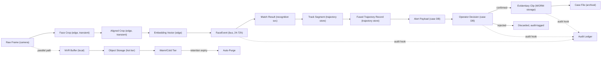
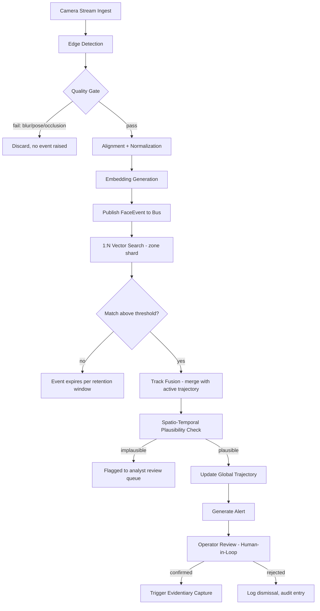
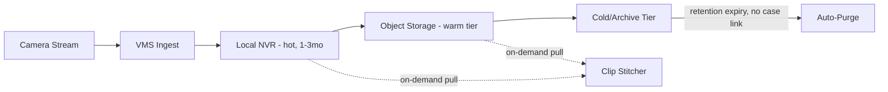
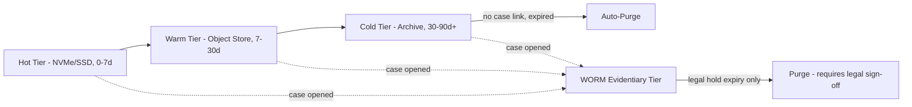
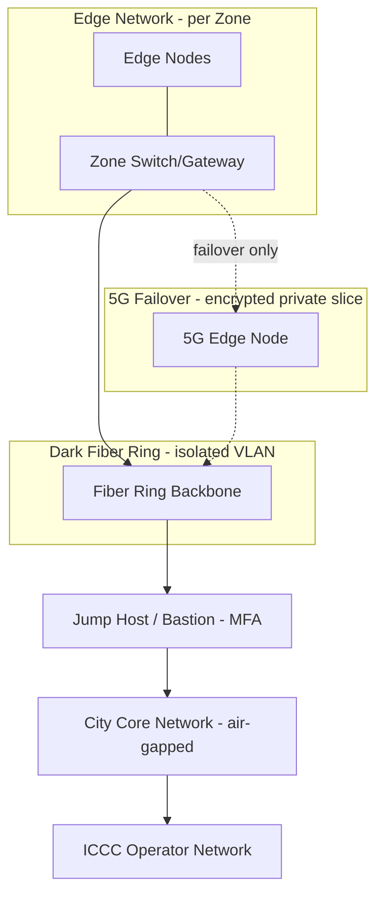
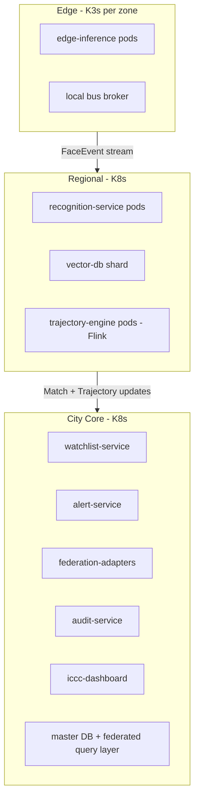
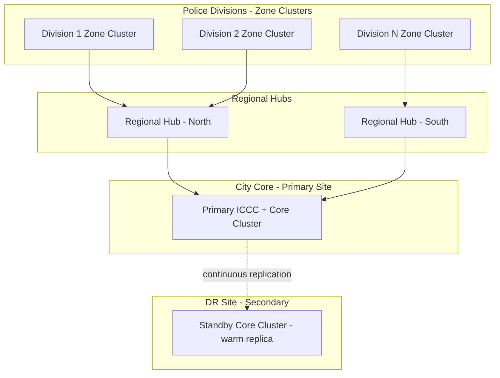

# CCTV FRS — Data Flow, Data Pipeline, File/Folder Structure & Deployment Topology

---

## 1. Data Flow Architecture (Data-Centric)

### 1.1 Data Artifact Table

Every object the system creates, transforms, or stores, end to end.

| # | Data Object | Generated At | Format/Content | Approx Size | Stored In | Retention | Consumed By |
|---|---|---|---|---|---|---|---|
| 1 | Raw video frame | Camera sensor | H.264/H.265 stream | 4–25 Mbps/stream | Local NVR only, never centralized | Per NVR policy | Edge AI Node, Local NVR |
| 2 | Detected face crop | Edge — detection | JPEG sub-image | 5–20 KB | Edge RAM (transient) | Discarded post-embed | Edge alignment stage |
| 3 | Aligned/normalized crop | Edge — alignment | Fixed matrix (e.g. 112×112) | ~10 KB | Edge RAM (transient) | Discarded post-embed | Edge embedding stage |
| 4 | Embedding vector | Edge — vectorization | Float32, 128–512 dims | 0.5–2 KB | Embedded in FaceEvent only | Ephemeral | Recognition Service |
| 5 | FaceEvent message | Edge → Bus | `{event_id, camera_id, zone_id, ts, vector, bbox, quality_score}` | 2–5 KB | Event bus buffer | 24–72h unless matched | Recognition Service, Trajectory Engine, Audit |
| 6 | Match result | Recognition Service | `{event_id, target_id, confidence, watchlist_ref}` | ~1 KB | Recognition output topic | Linked to trajectory lifetime | Trajectory Engine |
| 7 | Track segment | Trajectory Engine | `{track_id, camera_id, entry/exit ts, appearance_features}` | ~2 KB | Trajectory Store | Case lifetime | Track Fusion, Alert Service |
| 8 | Fused trajectory record | Track Fusion + plausibility gate | `{global_track_id, target_id, ordered segments, geo path, validated}` | 5–50 KB | Trajectory Store | Case + legal retention | Alert Service, ICCC |
| 9 | Alert payload | Alert Orchestration | `{alert_id, target_id, confidence, GIS coord, thumbnail, ts, trajectory_ref}` | 50–200 KB | Alert queue + Case DB | Case lifetime | ICCC Dashboard, Field push |
| 10 | Operator decision record | ICCC operator action | `{alert_id, operator_id, decision, ts, notes}` | <1 KB | Case DB | Permanent | Audit Ledger, Case File |
| 11 | Evidentiary clip | Clip Stitcher (on confirm) | Stitched video, hash-signed | 50–500 MB | WORM Object Storage | Legal retention mandate | Court record, Case File |
| 12 | Case file | Case Management | Target + alerts + trajectory + clip refs | Varies | Case DB + storage refs | Legal case policy | Legal, oversight |
| 13 | Audit log entry | Every write, all services | `{actor, action, ts, object_ref, hash}` | <1 KB | Immutable Ledger (WORM) | Permanent | Compliance, legal |
| 14 | Watchlist entry | Enrollment workflow | `{target_id, reference_embedding, case_ref, authorization_ref, expiry}` | 2–5 KB | Vector DB + Case DB | Until case closure | All zone recognition shards |

### 1.2 Data Transformation Flow

---

## 2. Data Pipelines

### 2.1 Real-Time Recognition & Tracking Pipeline

### 2.2 Recording & Archival Pipeline

### 2.3 Watchlist Enrollment Pipeline
1. Operator uploads reference photo via secure console.
2. Authorization check — case reference + approving officer required.
3. Centralized Detect → Align → Embed (enrollment-grade, stricter threshold than live feed).
4. Write embedding to Vector DB; propagate to all zone shard replicas.
5. Audit log entry created.

### 2.4 Federated National Database Sync Pipeline
1. External system (CCTNS / AFRS / local FIR) emits update webhook.
2. Adapter microservice validates and transforms payload to internal schema.
3. Routed through Enrollment Pipeline (steps 2–5), pending local authorization confirmation.
4. Audit entry logged with source-system reference.

### 2.5 Model Update / MLOps Pipeline
1. New model candidate registered in Model Registry.
2. Shadow evaluation against replayed historical FaceEvents — no live impact.
3. Bias/accuracy benchmark across demographic test sets.
4. Canary rollout to one zone.
5. Full rollout if canary passes; old model deprecated.
6. If embedding space changed: full watchlist re-embedding job runs before cutover.

### 2.6 Audit & Compliance Pipeline (cross-cutting)
1. Every write across 2.1–2.5 emits an audit event.
2. Event appended to immutable ledger (WORM).
3. Periodic Merkle-root anchoring for tamper-evidence.
4. On-demand compliance export for oversight/legal review.

---

## 3. Data Lifecycle & Retention

| Data Type | Storage Tier | Default Retention | Purge Trigger | Encryption |
|---|---|---|---|---|
| Raw video (unmatched) | Hot → Warm → Cold | 30–90 days (policy-set) | Time expiry, no case link | At rest + in transit |
| FaceEvent (no match) | Bus buffer only | 24–72h | Time expiry | In transit only |
| Watchlist embedding | Vector DB | Case lifetime + expiry | Case closure/expiry | At rest |
| Trajectory record | Trajectory Store | Case lifetime + legal hold | Case closure, no hold | At rest |
| Evidentiary clip | WORM Object Storage | Legal retention mandate | Legal sign-off only | At rest, hash-signed |
| Audit log entry | Immutable Ledger | Permanent | Never | At rest, append-only |
| Case file | Case DB + storage refs | Legal case policy | Legal closure + hold period | At rest |

### Storage Tiering Flow

---

## 4. File & Folder Structure

### 4.1 Codebase / Repository Structure

- `cctv-frs/` — monorepo root
  - `services/`
    - `edge-inference/` — detection, alignment, embedding, local tracking
    - `recognition-service/` — embedding validation, vector search client
    - `trajectory-engine/` — face + appearance fusion, plausibility gating
    - `watchlist-service/` — case/target management, enrollment workflow
    - `alert-service/` — alert orchestration, notification dispatch
    - `iccc-dashboard/` — operator web app, GIS map, video wall
    - `evidentiary-service/` — clip stitching, hash signing, chain of custody
    - `federation-adapters/`
      - `cctns-adapter/`
      - `afrs-adapter/`
      - `local-fir-adapter/`
    - `audit-service/` — immutable ledger writer, Merkle anchoring
  - `schemas/` — versioned message contracts (FaceEvent, MatchResult, AlertPayload, etc.)
  - `models/` — registry references, versioned configs (no weights in repo)
  - `infra/`
    - `helm-charts/` — per-service deployment charts
    - `terraform/` — cluster, network, storage provisioning
    - `k8s-manifests/`
      - `edge/`
      - `regional/`
      - `core/`
  - `observability/` — dashboards, alert rules, tracing configs
  - `docs/` — architecture, runbooks, compliance policies
  - `tests/` — integration, load, model-quality regression suites

### 4.2 Object Storage / Data Lake Structure

- `video-archive/`
  - `{zone_id}/{camera_id}/{yyyy}/{mm}/{dd}/` — raw video segments, hot/warm tier
- `evidentiary-clips/`
  - `{case_id}/{clip_id}.mp4` + `{clip_id}.hash`
- `model-artifacts/`
  - `{model_name}/{version}/` — weights, config, benchmark report
- `watchlist-snapshots/`
  - `{date}/` — periodic vector DB backup
- `audit-exports/`
  - `{date}/` — compliance export bundles
- `logs/`
  - `{service_name}/{zone_id}/{yyyy-mm-dd}.log`

### 4.3 Edge Node Local Filesystem

- `/opt/frs-edge/`
  - `config/` — camera registry, model version pin, thresholds
  - `models/` — cached detection/embedding weights
  - `nvr-buffer/` — rolling local video buffer
  - `spool/` — outbound FaceEvent queue (persists locally if bus unreachable)
  - `logs/` — local logs, forwarded to central observability

### 4.4 Config & Secrets
- Per-environment config lives in GitOps repo (`infra/k8s-manifests/{env}/`).
- Secrets never committed — injected via Vault at deploy time.
- Camera credentials, model registry tokens, federation adapter keys: Vault-managed, rotated per policy.

---

## 5. Deployment Topology

### 5.1 Node & Cluster Types

| Tier | Node Role | Runtime | Scaling Unit | Approx Count (5000-camera baseline) |
|---|---|---|---|---|
| Edge | Edge AI Node (4–8 cameras each) | K3s + DeepStream/TensorRT | +1 node per camera cluster | 625–1250 nodes |
| Zone | Zone Aggregator (per division) | K3s, local bus broker | +1 cluster per division | 25–40 clusters |
| Regional | Regional Hub (groups zones) | Full K8s, vector DB shard, Flink | +1 hub per N zones | 4–8 hubs |
| City Core | Core Cluster | Full K8s, federated query, master DB | Vertical + read replicas | 1 primary + 1 DR |
| ICCC | Operator workstations | Thin client to core dashboard | +1 per seat | Per staffing plan |

### 5.2 Network Zone Topology

### 5.3 Kubernetes Cluster Topology

### 5.4 Geographic Deployment Map

### 5.5 High Availability / Disaster Recovery
- City Core: active-primary + warm-standby DR site, continuous replication, automated failover.
- Regional hubs: N+1 redundancy within region.
- Zone clusters: autonomous local buffering on backbone loss; replay on reconnect.
- Vector DB: replica factor ≥2 per shard, cross-site if available.

---

## 6. Topology Summary

| Tier | HA Strategy | Scaling Unit | Failure Domain |
|---|---|---|---|
| Edge | Local spool buffer on disconnect | Per camera cluster | Single zone segment |
| Zone | Local bus buffer, autonomous operation | Per division | Single division |
| Regional | N+1 replica pods, sharded vector DB | Per zone group | Single region |
| City Core | Active-primary + warm DR standby | Vertical + read replicas | City-wide (mitigated by DR) |
| ICCC | Stateless thin clients | Per operator seat | Single workstation |
