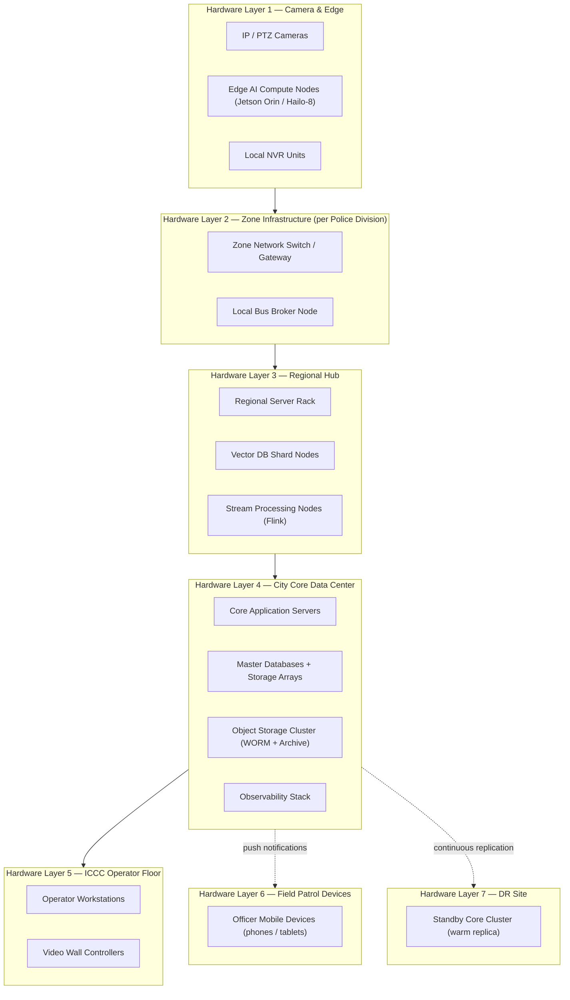
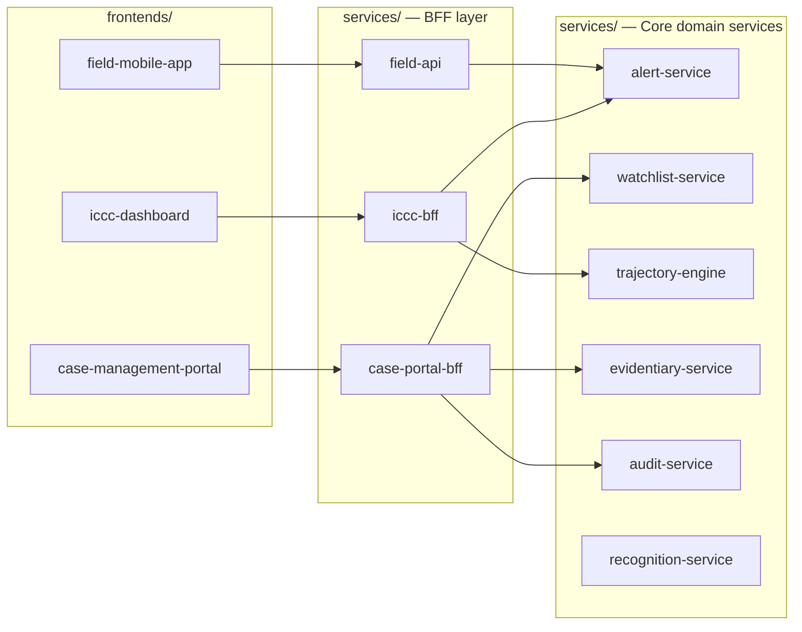

# CCTV FRS — Hardware Layers, Frontend Placement & Frontend/Backend Separation

---

## 1. High-Level Hardware Layers



| Layer | Hardware | Primary Function |
|---|---|---|
| 1 — Camera & Edge | Cameras, Edge AI nodes, NVRs | Capture, detect, embed, buffer |
| 2 — Zone | Switch/gateway, local broker node | Aggregate and forward events per division |
| 3 — Regional Hub | Server rack, vector DB shard, Flink nodes | Vector search, trajectory processing |
| 4 — City Core | Application servers, master DBs, object storage | Watchlist, alerts, case management, ICCC backend |
| 5 — ICCC Operator Floor | Operator workstations, video wall | Operator interaction and command |
| 6 — Field Patrol | Officer mobile devices | Receive alerts, field acknowledgment |
| 7 — DR Site | Standby core cluster | Failover only |

---

## 2. Where Frontends Are Needed

### 2.1 Decision Principle
A frontend is needed wherever a **human operator or officer interacts with the system directly**. All other layers are infrastructure — they run backend services, databases, and compute pipelines with no human-facing UI.

| Hardware Layer | Frontend Needed? | Reason |
|---|---|---|
| 1 — Camera & Edge | No | Fully automated inference, no human interaction |
| 2 — Zone | No | Network forwarding, no human interaction |
| 3 — Regional Hub | No | Automated stream processing, no human interaction |
| 4 — City Core | Yes — ICCC Dashboard + Case Management Portal | Serves operators at Layer 5 |
| 5 — ICCC Operator Floor | Renders Layer 4 frontends | Thin client; frontends are served from Layer 4 |
| 6 — Field Patrol | Yes — Field Mobile App | Officers receive alerts, confirm/acknowledge in the field |
| 7 — DR Site | No separate frontend | DR mirrors Layer 4 backends; frontends auto-redirect on failover |

---

## 3. Frontends — What Each Serves

### 3.1 ICCC Operator Dashboard
**Served from:** City Core (Layer 4) → Rendered on ICCC Workstations (Layer 5)

| Feature | Purpose |
|---|---|
| Live alert feed | Real-time match alerts with thumbnail + confidence + camera ID |
| GIS trajectory map | Live geo-path of tracked target across camera network |
| Multi-camera video panel | Live + recorded feed from relevant cameras |
| Match confirmation gate | Human-in-the-loop confirm / reject action |
| Dispatch interface | Secure push to field units on confirmation |
| Operator audit view | Read-only view of own actions in audit log |

### 3.2 Case Management Portal
**Served from:** City Core (Layer 4) → Accessed by authorized analysts on ICCC Workstations (Layer 5)

| Feature | Purpose |
|---|---|
| Target enrollment | Upload reference photo, link case reference, authorization workflow |
| Case dashboard | Active and closed cases, alert history, trajectory records |
| Watchlist management | Add, update, expire, and archive watchlist entries |
| Evidentiary clip viewer | View and export hash-signed evidentiary video clips |
| Audit log viewer | Full audit trail with filters — for compliance and oversight |
| User/role management | RBAC — assign roles, manage accounts, set zone-scoped access |
| National DB sync status | Live status of CCTNS/AFRS/FIR adapter feeds |

### 3.3 Field Mobile App
**Served from:** City Core (Layer 4) via encrypted push → Runs on Officer Mobile Devices (Layer 6)

| Feature | Purpose |
|---|---|
| Alert notification | Encrypted push alert on match confirmation |
| Target info card | Thumbnail, confidence score, last known location |
| GIS mini-map | Last-seen location plotted on street map |
| Field acknowledgment | Officer confirms receipt and marks response status |
| Secure messaging | Encrypted back-channel to ICCC operator |

---

## 4. Frontend / Backend Separation Principle

### Architecture Pattern: Backend for Frontend (BFF)

Each frontend has a **dedicated BFF service** in the backend. The BFF is the only backend component the frontend communicates with. It handles auth, data aggregation, protocol translation, and data shaping for that specific client. Core domain services never receive direct calls from any frontend.



**Rules:**
- Frontends call only their BFF — no direct calls to domain services.
- BFFs are stateless — all state lives in domain services and databases.
- BFFs handle authentication/session validation before forwarding any request.
- Domain services expose internal APIs only within the backend network.

---

## 5. Updated Folder Structure

Changes from the previous document: `iccc-dashboard` removed from `services/` and placed under `frontends/`. Three BFF services added to `services/`. All frontend apps now live under a top-level `frontends/` directory, fully separate from all backend code.

```
cctv-frs/
├── frontends/
│   ├── iccc-dashboard/              # ICCC operator web app (React, WebRTC, Mapbox/Cesium)
│   │   ├── src/
│   │   │   ├── pages/
│   │   │   ├── components/
│   │   │   ├── store/
│   │   │   ├── services/            # API client calls to iccc-bff only
│   │   │   └── assets/
│   │   ├── public/
│   │   └── config/                  # Env-specific endpoint configs (no secrets)
│   │
│   ├── case-management-portal/      # Case/watchlist/audit web app (React)
│   │   ├── src/
│   │   │   ├── pages/
│   │   │   ├── components/
│   │   │   ├── store/
│   │   │   ├── services/            # API client calls to case-portal-bff only
│   │   │   └── assets/
│   │   ├── public/
│   │   └── config/
│   │
│   └── field-mobile-app/            # Officer mobile app (React Native / Flutter)
│       ├── src/
│       │   ├── screens/
│       │   ├── components/
│       │   ├── services/            # API client calls to field-api only
│       │   └── assets/
│       └── config/
│
├── services/
│   │
│   ├── — BFF Layer (frontend-facing) ——————————————————
│   ├── iccc-bff/                    # BFF for iccc-dashboard
│   ├── case-portal-bff/             # BFF for case-management-portal
│   ├── field-api/                   # BFF for field-mobile-app
│   │
│   ├── — Core Domain Services (internal only) ————————
│   ├── edge-inference/              # Detection, alignment, embedding, local tracking
│   ├── recognition-service/         # Vector search, match validation
│   ├── trajectory-engine/           # Track fusion, plausibility gating
│   ├── watchlist-service/           # Case/target management, enrollment workflow
│   ├── alert-service/               # Alert orchestration, notification dispatch
│   ├── evidentiary-service/         # Clip stitching, hash signing, chain of custody
│   ├── audit-service/               # Immutable ledger writer, Merkle anchoring
│   │
│   └── federation-adapters/
│       ├── cctns-adapter/
│       ├── afrs-adapter/
│       └── local-fir-adapter/
│
├── schemas/                         # Versioned message contracts (Protobuf/Avro/OpenAPI)
│   ├── events/                      # FaceEvent, MatchResult, AlertPayload, etc.
│   └── api/                         # REST/gRPC contracts for BFF ↔ domain services
│
├── models/                          # Model registry references, version configs
│
├── infra/
│   ├── helm-charts/
│   │   ├── edge/
│   │   ├── regional/
│   │   └── core/
│   ├── terraform/
│   └── k8s-manifests/
│       ├── edge/
│       ├── regional/
│       └── core/
│
├── observability/                   # Dashboards, alert rules, tracing configs
├── docs/                            # Architecture, runbooks, compliance policies
└── tests/
    ├── integration/
    ├── load/
    └── model-quality/
```

---

## 6. Deployment Placement of Frontends in Hardware Layers

| Frontend | Built As | Deployed To | Rendered On |
|---|---|---|---|
| `iccc-dashboard` | Static web bundle | City Core (Layer 4) — served via CDN/nginx pod in core K8s | ICCC Operator Workstations (Layer 5) — browser |
| `case-management-portal` | Static web bundle | City Core (Layer 4) — same origin or separate nginx pod | ICCC Operator Workstations (Layer 5) — browser |
| `field-mobile-app` | Native mobile binary | Distributed via MDM to officer devices; BFF endpoint at City Core (Layer 4) | Officer Mobile Devices (Layer 6) |

**BFF services** are deployed alongside other backend services in City Core (Layer 4) inside the core K8s cluster — they are backend, not frontend, regardless of their purpose.

**DR Site (Layer 7):** Frontend static assets are replicated. BFF endpoints auto-redirect to DR on failover via DNS/load-balancer — no separate frontend deployment needed at DR.
